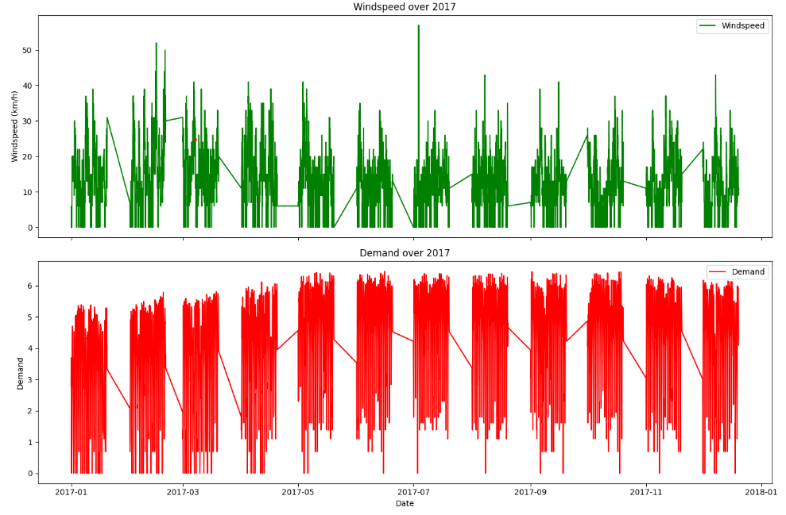

# CarSharing Insights: A Comprehensive Data Management and Analytical Approach

# Description
This project encompasses a comprehensive analysis and management of a car-sharing service dataset, which includes customer demand data collected hourly from January 2017 to August 2018. The dataset incorporates diverse attributes such as time, weather conditions, temperature, and demand rates. The objective is to facilitate database management tasks and conduct in-depth data analytics to uncover patterns and insights that can inform business strategies and operational improvements.

# Table of Contents

[Installation](#Installation)

[Usage](#Usage)


[Credits](#Credits])

## Installation
### 1.Prerequisites: 
Ensure Python 3 is installed on your system. You can download it from python.org.
### 2. Clone the Repository
```
git clone https://github.com/TechAriel/CarSharing-Data-Analysis.git
```
```
cd CarSharing-Data-Analysis
```

### 3. Install Dependencies
```
pip install sqlite3
```
### 4. Database Setup
Ensure SQLite3 is installed on your system, which will be used for database operations.
Use the provided script "Database Management.py" to setup and populate your database.

## Usage

### * Database Management
Run the script Database Management.py to perform database initialization, data importing, and transformation tasks as outlined in Part I of the coursework.
```
python Database Management.py
```
### * Data Analytics 
After setting up the database, use Data Analytics.py to execute various data analysis tasks including statistical tests, pattern recognition, and predictive modeling as detailed in Part II of the coursework.
```
python Data Analytics.py
```
### *1. Data Cleaning Process*

The output showing the summary of null values before and after filling.
Before proceeding with the imputation of missing values, we conducted a thorough assessment of the distributions for the columns with null values. 
This assessment helps in choosing the most appropriate method for filling in these values—whether mean, median, or another method—based on characteristics like skewness, presence of outliers, and central tendency.


### *2. Statistical Analysis Output*

The output from Pearson correlation and ANOVA tests that identifies significant relationships between features and demand.


### *3. Seasonal and Cyclic Patterns Visualization*

A series of plots showing temperature, humidity, windspeed, and demand over 2017. This visually demonstrates how each factor varies through the year.




### *4. Predictive Modeling Results*

Results of the ARIMA model predictions versus actual data, showcasing the model's predictive power for demand forecasting.


### *5. Comparison of Machine Learning Model Performances*

The output showing the mean squared errors from Random Forest and Neural Network Models, providing a clear comparison of their performance.


### *6. Classification Model Accuracies*

The accuracy results for Logistic Regression, Random Forest, and Gradient Boosting classifiers, highlighting the effectiveness of each model.


### *7. Clustering Analysis*

Output showing variance of sample counts in clusters for different values of k, demonstrating the analysis used to determine the most uniform cluster distribution.


## Credits
This project was developed as part of the CSC-40054 coursework at Keele University, under the guidance of Module Leader Dr. Wenjuan Zhou. The entire project, including database management, data analysis, and the compilation of this README, was carried out individually by:

Author: [Gabriel Oduor]
Contact: [gabriel.okoth101@gmail.com]
GitHub Profile: [TechAriel](https://github.com/TechAriel/)
I welcome any questions, comments, or suggestions for improvement. Please feel free to open an issue or submit a pull request on the repository.
